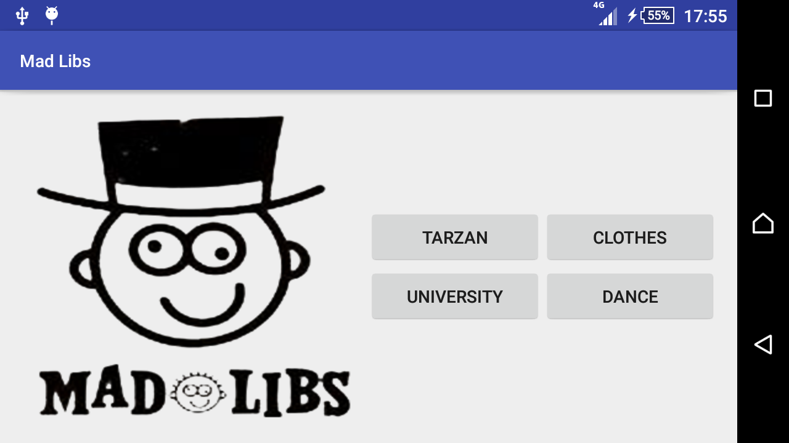
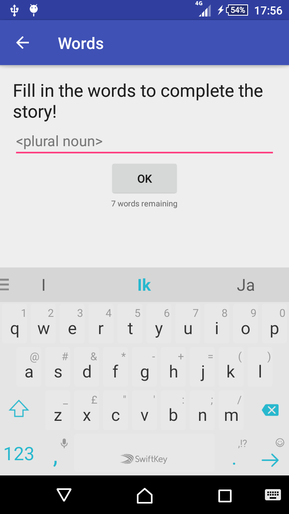
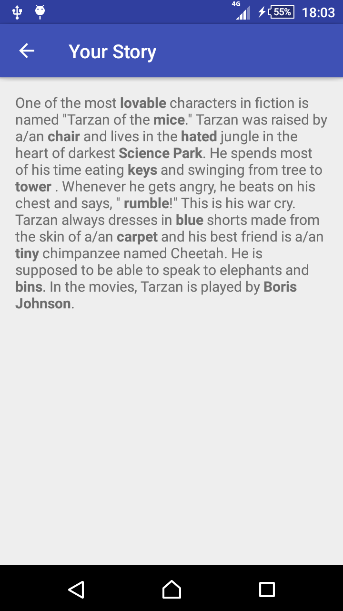

# Native App Studio: Mad Libs
By Matthew van Rijn (10779353)

This app allows you to create your own story by filling in certain words.

### Activities
The app consists of three activities. One activity for selecting the story of which to fill the words in, one for filling in the words and one for viewing the completed story.

#### Menu
The menu activity displays the project logo and four buttons which each link to one of the supplied stories.

#### Words
The words activity allows the user to enter the words for the story. The type of the required word is shown as the hint in the text field. After filling in the word, the user can press the OK button button to proceed to the next word or use the NEXT button on their software keyboard (where the ENTER key ususally is). If the user makes a spelling error or would like to change the chosen word, they can do so by pressing the Android back button. The back button at the top left behaves differently; it returns the app to the main menu. Once all words have been entered, the app proceeds to display the story.

#### Story
The story activity displays the completed story with all user-chosen words in bold. If the story is too long to fit on the screen it is scrollable. To change one or more of the words the user can still press either of the back buttons, or they can return to the main menu by pressing the top-left back button twice and select a new story.

